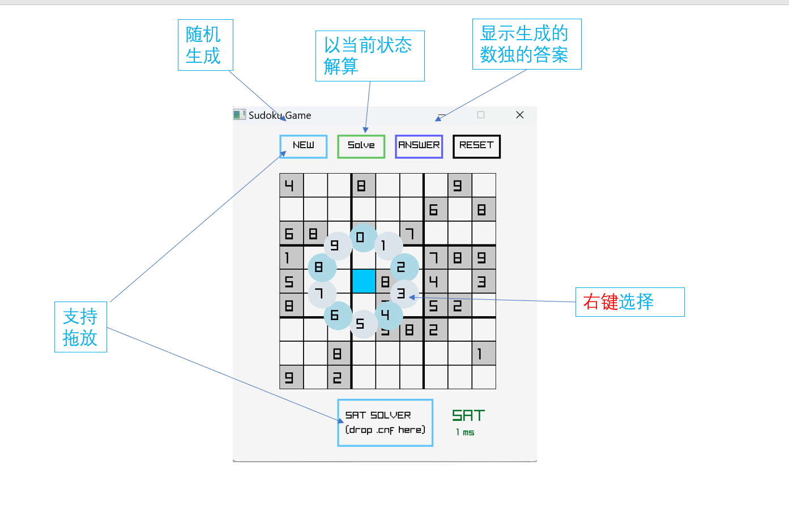
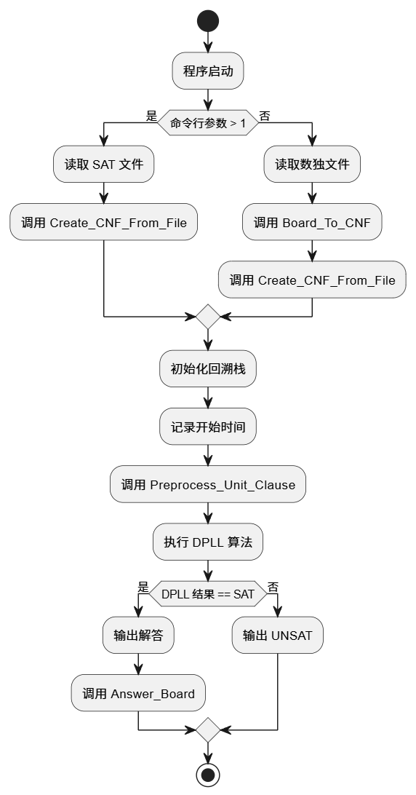

# 运行方式：

**[main_gui.exe](./main_gui.exe)和[raylib.dll](./raylib.dll)置于同一目录下，双击exe运行。**

---

# 操作说明：

左键点击展开轮盘

**右键**选择数字

`右键`选择数字

*右键*选择数字

> 右键😠选择数字

### **1. 上方四个按钮**分别是：

* NEW：新游戏
* SOLVE：DPLL算法解算填充数独。需要注意的是，解算是按照当前实时的数独计算的，也就是说，如果手动填充了部分，可能会导致UNSAT
* ANSWER：挖洞法的答案
* RESET：恢复

### 2. 下方

* SAT SOLVER：实现了drag-drop，将cnf文件拖拽到框内即可解算（复杂cnf会无响应，需要手动强行关闭）
* SAT 1ms：即SAT/UNSAT两种结果，并显示解算时长。



# 工程源码说明文档

## 编译与运行

### 目录结构

* **src** : 源代码目录，包含主要的程序入口文件和相关的头文件。
* **`main_cli.cpp`** : 命令行界面的主程序入口。
* **`main_gui.c`** : 图形用户界面的主程序入口。
* **`include/`** : 包含项目的头文件。
  * **`Global.h`** : 定义了全局变量或全局配置。
  * **`myIntStack.h`** : 一个自定义的整数栈实现。
  * **`myIntVector.h`** : 一个自定义的整数向量实现。
  * **`raylib.h`** : 图形库 `raylib` 的头文件。
  * **`SAT.h`** : 包含与 SAT 求解器相关的声明。
  * **`Sudoku.h`** : 包含与数独相关的声明。
* **`lib/`** : 包含项目依赖的库文件。
  * **`libraylibdll.a`** 和**`raylib.dll`**: `raylib` 图形库的动态链接库。
* **`使用说明.png`** : 程序的使用说明图片。

### 编译

1. 确保安装了支持 C++ 的编译器（如 GCC 或 MSVC）。
2. 将 raylib.dll 放置在编译器可访问的路径中。
3. 运行build.bat编译（以 GCC 为例）：

   ```
   cd src
   gcc -o ../gui.exe main_gui.c -Iinclude -Llib -lraylibdll -mwindows
   ```

### 运行

1. 双击 main_gui.exe 或在终端中运行：
2. 按照界面提示输入数独问题，点击求解按钮查看结果。

以下是对算法实现的详细说明：

---

# 算法实现说明



## 1. 问题描述

数独问题是一种经典的约束满足问题（CSP），目标是将一个 9x9 的网格填充数字，使得每行、每列和每个 3x3 的子网格中的数字均为 1 到 9，且不重复。

本项目通过将数独问题转化为布尔可满足性问题（SAT），并使用 DPLL（Davis-Putnam-Logemann-Loveland）算法求解。

---

## 2. 算法流程

### 2.1 数独转化为 SAT

1. **变量编码** :
   使用三维布尔变量 `X_{i,j,k}` 表示数独网格中的每个单元格：

* `i` 表示行号（1 到 9）
* `j` 表示列号（1 到 9）
* `k` 表示数字（1 到 9）
* `X_{i,j,k} = true` 表示单元格 `(i, j)` 填入数字 `k`

1. **约束条件** :
   将数独规则转化为布尔公式：

* **单元格唯一性** : 每个单元格只能填入一个数字。
* **行唯一性** : 每行的每个数字只能出现一次。
* **列唯一性** : 每列的每个数字只能出现一次。
* **子网格唯一性** : 每个 3x3 子网格的每个数字只能出现一次。
* **初始条件** : 根据输入的数独题目，添加固定的单元格值。

1. **生成 CNF（合取范式）** :
   将上述约束条件转化为 CNF 公式，供 SAT 求解器使用。

---

### 2.2 DPLL 算法

DPLL 是一种递归回溯算法，用于判断布尔公式是否可满足。其核心步骤如下：

1. **单子句传播（Unit Propagation）** :
   如果公式中存在单子句（仅包含一个文字的子句），则该文字必须为真。将其赋值并简化公式。
2. **纯文字消除（Pure Literal Elimination）** :
   如果某个文字在公式中仅以一种极性（正或负）出现，则可以直接赋值为真。
3. **分支（Decision Making）** :
   从未赋值的变量中选择一个进行赋值，递归求解。
4. **回溯（Backtracking）** :
   如果某个分支导致公式不可满足，则回溯并尝试其他赋值。
5. **终止条件** :

* 如果公式为空（所有子句均为真），则公式可满足。
* 如果公式包含空子句（无文字的子句），则公式不可满足。

---

## 3. 数据结构

### 3.1 栈（`myIntStack.h`）

* 用于存储变量赋值的历史记录，支持回溯操作。
* 提供以下操作：
  * `push`：将元素压入栈。
  * `pop`：弹出栈顶元素。
  * `top`：获取栈顶元素。

### 3.2 动态数组（`myIntVector.h`）

* 用于存储布尔公式中的子句和文字。
* 提供动态扩展功能，支持高效的插入和删除操作。

---

## 注意事项

1. **依赖库** :GUI 模块依赖 `raylib` 库，请确保 raylib.dll 文件完整。
2. **兼容性** :本项目在 Windows 系统上开发和测试，其他平台可能需要额外配置。
